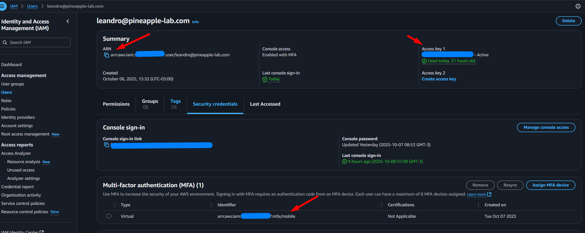
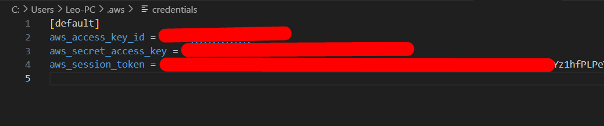
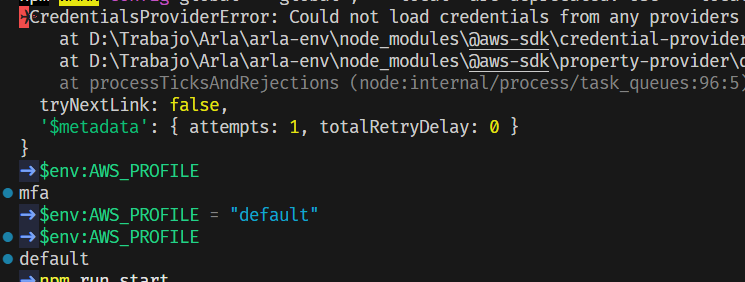

# Project: get-token

This project allows you to obtain a temporary AWS token using MFA (Multi-Factor Authentication). The generated credentials are valid for `12 hours`.

## Environment requirements (`.env`)

**Team:** If you have questions about the `.env` configuration or project usage, contact the repository maintainer.
To run the project, you must create a `.env` file in the root directory with the following variables:

```
AWS_ACCESS_KEY_ID=your_access_key_id
AWS_SECRET_ACCESS_KEY=your_secret_access_key
AWS_MFA_ARN=arn:aws:iam::123456789012:mfa/your-user
AWS_REGION=us-east-1
```

- `AWS_ACCESS_KEY_ID`: Your AWS Access Key ID.
- `AWS_SECRET_ACCESS_KEY`: Your AWS Secret Access Key.
- `AWS_MFA_ARN`: ARN of the MFA device associated with your AWS user.
- `AWS_REGION`: AWS region to use (e.g., `us-east-1`).

**Note:** Do not share your `.env` file or credentials.

## Usage

1. Install dependencies:
   ```sh
   npm install
   ```
2. Run the main script:
   ```sh
   npm run start
   ```
3. Close all <arla> projects in your editor (VS Code) to reset the terminals and clear any cached profiles from the session.

## Additional Documentation

This project generates temporary AWS access tokens (access key, secret key, and session token) and writes them to the file `~/.aws/credentials` for use with the AWS CLI and SDKs. The generated credentials are valid for 12 hours.

## Example

**IAM user configuration or permissions diagram: copy to .env**


**Example of an MFA code or MFA device screenshot: paste the MFA code**


**Access configuration with session token**


---

## Common errors:

0. Close all <arla> projects in your editor (VS Code) to reset the terminals and clear any cached profiles from the session.

1. `AccessDenied: User: arn:aws:iam::<ACCOUNT_ID>:user/user@example.com is not authorized to perform: s3:GetObject on resource: "arn:aws:s3:::<aws-resources>/<aws-resources-id>" with an explicit deny in an identity-based policy`

   This happens because you’re trying to access AWS resources directly with your user, and the applied policy doesn’t allow access for users without MFA.

   **Solution**: Run the project **aws-mfa-token-generator** using your MFA code to generate a new token valid for 12 hours.

2. `✈CredentialsProviderError: Could not load credentials from any providers`
2.1 `Error [CredentialsError]: Missing credentials in config, if using AWS_CONFIG_FILE, set AWS_SDK_LOAD_CONFIG=1`

   The configuration to load environment variables into the profile can’t be found.
   In this example, it’s using the `[mfa]` configuration by default — you can check it with the command `$env:AWS_PROFILE`.

   **Solution**: Change the configuration to use `[default]`.
   In the CLI, run:

   **Windows**
   ```bash
   $env:AWS_PROFILE = "default"
   ```

   **mac/linux**
   ```bash
   export AWS_PROFILE=default
   ```


   

3. `ExpiredToken: The provided token has expired.`

   This occurs when the token has expired — the temporary credentials generated with MFA last for 12 hours.

   **Solution**: Run the project **aws-mfa-token-generator** using your MFA code to generate a new token valid for another 12 hours.